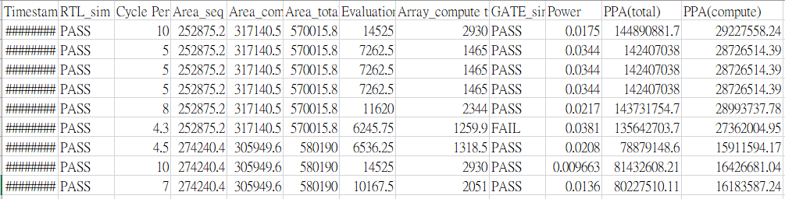
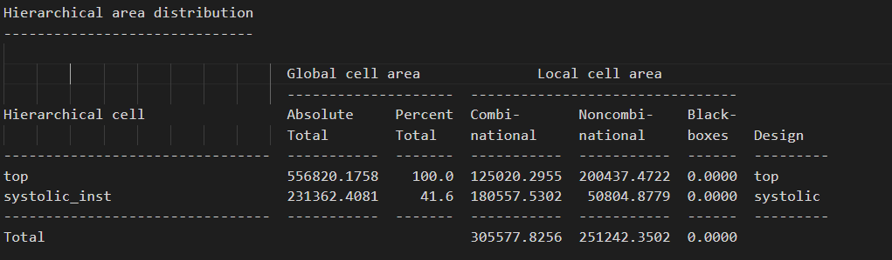
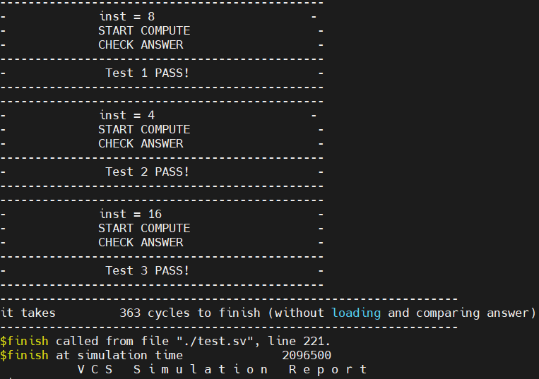
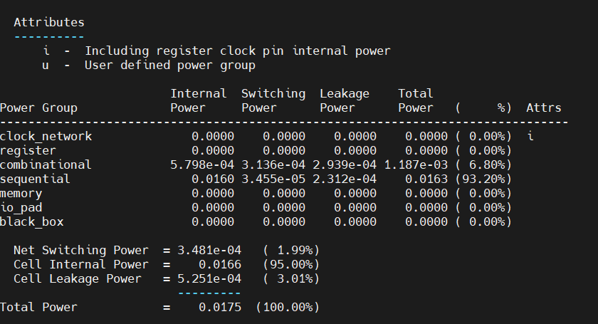

# 🛠️ Test1 Matrix Multiplication

## **Outline**
```
|__ Results
|__ Evaluation Program: eval.py
|__ Fixed-Point Matrix Data Generator
|__ Testbench – Matrix Multiplication Verification
|__ Design Under Test (RTL)
|__ Synthesis

```
---
##  **Project Structure**
```

├── python/      # Data generation, analysis, and helper scripts
├── 01_RTL/      # RTL source code, simulation testbenches, run scripts - source 01_run
├── 02_SYN/      # Design-Compiler synthesis scripts, reports, netlists - source 02_run
├── 03_GATE/     # Gate-level simulation files (post-synthesis + SDF)   - source 03_run
├── 04_POWER/    # Power analysis scripts and reports                  - source 04_run
├── eval.py      # Evaluation script to collect PPA metrics into CSV
└── run.sh       # Batch regression script (20× data_gen ➜ RTL sim)
└── Image/       # Images for documentation and reports
```

## **Quick reference**

| Path           | Purpose in the flow                                                                          |
| -------------- | -------------------------------------------------------------------------------------------- |
| **python/**    | Generates random fixed-point matrices (`data_generate.py`) and other utilities.              |
| **01\_RTL/**   | Contains Verilog/SystemVerilog RTL, `test.sv`, and `01_run` to compile & simulate.      |
| **02\_SYN/**   | Holds `syn.tcl`, `syn.sdc`, and `02_run` for synthesis; outputs to `Netlist/` & `Report/`.   |
| **03\_GATE/**  | Stores post-synthesis netlist (`*_syn.v`), SDF, and gate-level simulation results.           |
| **04\_POWER/** | Contains power estimation scripts (`04_run`) and generated reports.                          |
| **eval.py**    | Collects PPA (Performance, Power, Area) metrics across all stages into `evaluation.csv`.     |
| **run.sh**     | Automates **RTL regression flow**, generating fresh data and verifying correctness 20 times. |

---


## 🧩 Results

🧩 **PPA Summary**

---
* **The lowest clock cycle period achieved:**
  **3.7 ns** in the *0.130 µm* process.

* **Best ATP (Area × Timing × Power):**
  - Timing: **4.5 ns**,
  - Area: **580,190 mm²**,
  - Power: **0.208 mW**,
  - Computing time: **1318 ns**,
  - Total execution time (including loading and comparing): **6536 ns**

* **Area Proportion by Component:**
  Memory: **36%**
  Control Logic: **22%**
  Systolic Array: **23%**

* **Logic Composition:**
  Sequential Logic: **45%**
  Combinational Logic: **55%**

* **Clock Gating Utilization:**
  Nearly **99%** of cells are clock-gated.
   
 

The area proportion for design not clock-gated yet.

🧩 **Design Constraints**

* The design space is primarily limited by **large input and output memories** and the logic required to manage them.
* Execution time is strongly influenced by **I/O bandwidth**, assuming only **one data per cycle** throughput.

🧩 **I/O Overhead**

* **Input loading:** requires **64 cycles**.
* **Output comparison:** requires **512 cycles**.
* Even with a fast compute core, I/O delays dominate total latency.

🧩 **Computation Timing**

* For **16×16 + 4×4 matrix multiplication**, the systolic array completes in **293 cycles**.
* For configurations **4×4×4×4, 8×4×4×8, and 16×4×4×16**, computation alone takes **363 cycles**, while the **overall execution time including I/O reaches 2166 cycles** (64*3 for input data, 512*3 for output data).

🧩 **Clock Gating Impact**

* Enabling clock gating reduced **power consumption by nearly 50%**.
* Internal Power of Memory consumes nearly 90% of the total power, this part could be further optimized by using SRAM instead of registers.

🧩 **Optimization Decisions**

* I **did not implement pipelining** for input/output transfers.

  * The **systolic array is the key focus**, and optimizing the I/O would **reduce design flexibility** for changing IO design in the future.

* Adopt **Output Stationary** design for the systolic array, which is more efficient for matrix multiplication. 
---

In 5ns clock period, the area is roughly 570,000 mm², 



### RTL Simulation PASS


### Power 


---

# 🎯 **Evaluation Program: eval.py**
## 🎯 **1. Overview**

✅ **RTL Simulation**
✅ **Synthesis Report Extraction**
✅ **Gate-Level Simulation**
✅ **Power Estimation**
✅ **Result Logging to `evaluation.csv`**

---

## 🎯 **2. How to Run**

From the project root directory:

```bash
python3 evaluation.py
```


## 🎯 **3. Output: `evaluation.csv`**

Each run appends a row to `evaluation.csv` with all metrics.
If the file does not exist, it automatically creates the header.

**Columns:**

| Column                  | Description                                |
| ----------------------- | ------------------------------------------ |
| Timestamp               | Date and time of evaluation                |
| RTL\_sim                | PASS or FAIL from RTL simulation           |
| Cycle Period            | Clock period in ns                         |
| Area\_seq(mm^2)         | Sequential (non-combinational) cell area   |
| Area\_comb(mm^2)        | Combinational cell area                    |
| Area\_total(mm^2)       | Total cell area                            |
| Evaluation time(ns)     | Evaluation time converted from ps          |
| Array\_compute time(ns) | Estimated compute time (`cycles × period`) |
| GATE\_sim               | PASS or FAIL from gate-level simulation    |
| Power(mW)               | Total estimated power consumption          |

---


# 🟢 **Fixed-Point Matrix Data Generator**

## 🟢 **1. Overview**

This tool:

1. Script randomly chooses `INSTR = [4, 8, 16]`
2. Generates random matrices of max size `16×4` and `4×16`
3. For each instruction:

   * Extracts `n×4` and `4×n` submatrices
   * Multiplies them
   * Zero-pads outputs
4. Saves:

   * `inst.hex`
   * `matrix{N}_A.hex`
   * `matrix{N}_B.hex`
   * `matrix{N}_O.hex`
   * Floating-point reference files for verification

---

## 🟢 **2. How to Run**

Run the script in a terminal:

```bash
python3 data_generate.py
```
---

# ✨ **Testbench – Matrix Multiplication Verification**

### Located in 01_RTL/test.sv
> Verify the correctness and measure timing of the matrix multiplication module **`top`**, including support for multiple instructions and auto-reporting of Pass/Fail.
---

## ✨ **1. Simulation Parameters**

| Macro              | Purpose                                     |
| ------------------ | ------------------------------------------- |
| `CYCLE = 10.0`     | Clock period (ns)                           |
| `RST_DELAY = 5.0`  | Reset asserted for 2 cycles                 |
| `MAX_CYCLE = 5000` | Simulation timeout in cycles                |
| `SDFFILE`          | Optional SDF file for gate-level simulation |

---

## ✨ **2. Reference Data**

**Files loaded:**

| Macro             | Description                       |
| ----------------- | --------------------------------- |
| `Matrix{n}_A_ref` | Matrix A for instruction n (16×4) |
| `Matrix{n}_B_ref` | Matrix B for instruction n (4×16) |
| `Matrix{n}_O_ref` | Golden output matrix n (16×16)    |
| `INST_ref`        | Instruction sequence (list of n)  |

> **Note:**
> Instructions can be `{4, 8, 16}`, and up to **3 instructions** are supported.
> Unused entries in `inst_m` should be zero.

---

## ✨ **3. Signals**

| Signal       | Direction | Purpose                    |
| ------------ | --------- | -------------------------- |
| `clk`        | in        | Clock                      |
| `rst`        | in        | Synchronous reset          |
| `addr_A/B/I` | out       | Address bus for A/B/Instr. |
| `en_A/B/I`   | out       | Enable signals             |
| `data_A/B/I` | out       | Input data bus             |
| `addr_O`     | out       | Read address for output    |
| `en_O`       | out       | Enable output read         |
| `data_O`     | in        | Output data bus            |
| `out_valid`  | in        | Output data valid          |
| `ap_start`   | out       | Start computation          |
| `ap_done`    | in        | Computation done flag      |

---

## ✨ **4. Test Flow**

### ✨ 4.1 Instruction Loop

**For each instruction:**

✨ **Instruction Write**
 Write instruction value to `data_I`, assert `en_I`.

✨ **Load Input Matrices**
 Iterate `i = 0~63`:
 – Provide `matrixA` and `matrixB` entries
 – Assert `en_A` / `en_B`

✨ **Start Compute**
 Assert `ap_start`.
 Wait for `ap_done`.

✨ **Output Validation**
 Iterate `j = 0~255`:
 – Read output word (`data_O`) if `out_valid`
 – Compare to the corresponding `matrixO` reference
 – Count correct/error entries

---

### ✨ 4.3 Execution Timing

During computation (`ap_start` active), count `exe_cycle` to measure performance (excluding load/compare).

---

# 🧊 **Design Under Test**

## 🧊 **1. Main Modules**

### 🧊 1.1 `top`

* Defined in: `top.sv`
* **Key Features:**
  * Memory blocks for input matrices A/B and instruction codes, output matrix O.
  * Control logic to manage the systolic array.
---

### 🧊 1.2 `systolic_array`

* Defined in: `systolic.sv`, module `systolic`
* **Key Features:**

  * Supports 4*4 systolic array configuration.
  * Input buffers for rearranging input data for systolic array.
  * Output stationary.
  * Outputs a matrix of accumulated results.
  * 
```
    // systolic array 

    //                 tileB_in[0]  tileB_in[1] tileB_in[2] tileB_in[3]
    //  tileA_in[0]    PE00         PE01        PE02        PE03
    //  tileA_in[1]    PE10         PE11        PE12        PE13
    //  tileA_in[2]    PE20         PE21        PE22        PE23
    //  tileA_in[3]    PE30         PE31        PE32        PE33
```
---

### 🧊 1.3 `pe` (Processing Element)

* Defined in: `systolic.sv`, module `pe`
* **Function:**
  Performs a single multiply-accumulate (MAC) operation on input operands.
* **Key Features:**

  * Keep partial sums in its registers.
  * Passes input A & B to the right and downward neighbors.
  * Operates in a pipelined fashion for throughput.

---

## 🧊 **2. Other Files**

✅ **`rtl_01.f`**
A filelist for compilation, listing the RTL source files.

✅ **`01_run`**
The main script to compile and simulate the design.


---

## 🌸 **Synthesis**

* **`syn.tcl`** – the main synthesis script
* **`syn.sdc`** – the timing-constraint file

Both are executed automatically by `source 02_run`, targeting the **TSMC 0.13 µm** cell library.

---

### 🌸 1. Directory layout

```
02_SYN/
├── syn.tcl      # synthesis script
├── syn.sdc      # timing constraints
├── filelist.v   # RTL source list
├── Netlist/     # synthesized netlists & SDF
└── Report/      # area / timing reports
```
---

On completion you will find:

* `Netlist/top_syn.v` – synthesized gate-level netlist
* `Netlist/top_syn.sdf` – back-annotation for timing sim
* `Report/top_syn.area`, `*.timing_min/max`, `*.cg` – key reports

Any fatal error in the flow will stop the script immediately thanks to `set -e` inside `02_run`.

---
